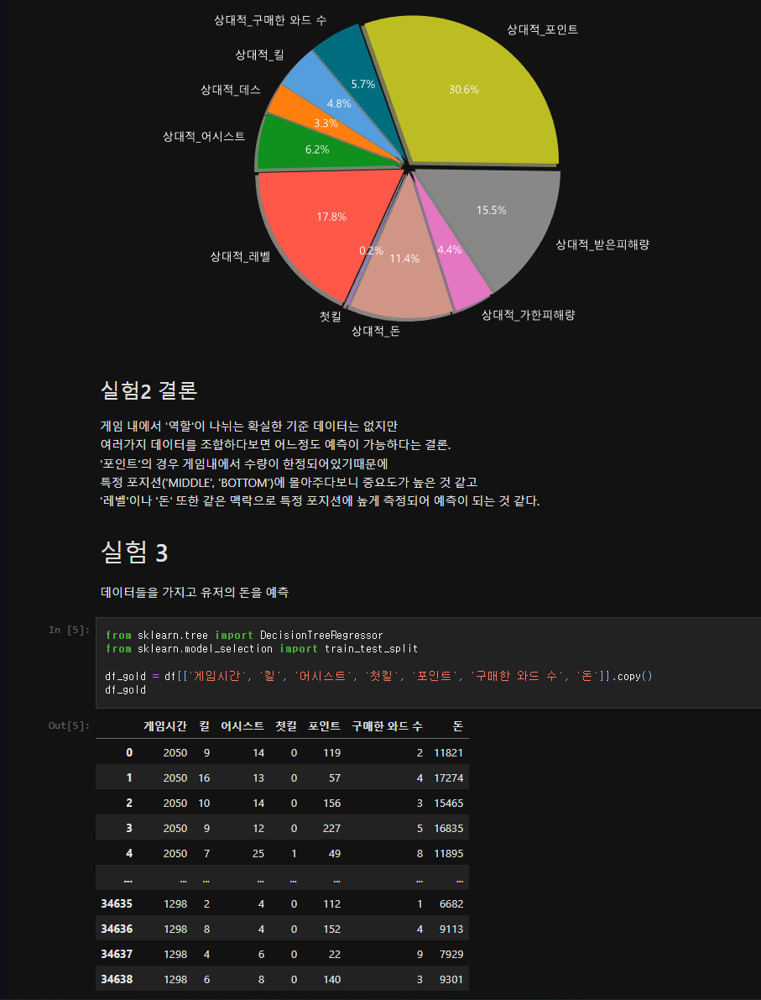

# 게임 데이터 분석 및 예측 모델 생성  

## Features
- League Of Legends 데이터 수집
- League Of Legends 데이터 전처리
- 실험 1: League Of Legends, Middle 포지션 유저의 승패 예측 모델 생성
- 실험 2: League Of Legends, 유저의 포지션 예측 모델 생성
- 실험 3: League Of Legends, 유저의 획득 골드 예측 모델 생성
- 실험 4: 동물 이미지로 이름 예측 모델 생성  
 

## Code & Result :memo:  

[Code Link](https://github.com/jtj8412/data-analysis/blob/main/data_analysis.ipynb)  

   

## Youtube :movie_camera:
[Youtube Link](https://youtu.be/BGcJGCGU1ok)  

